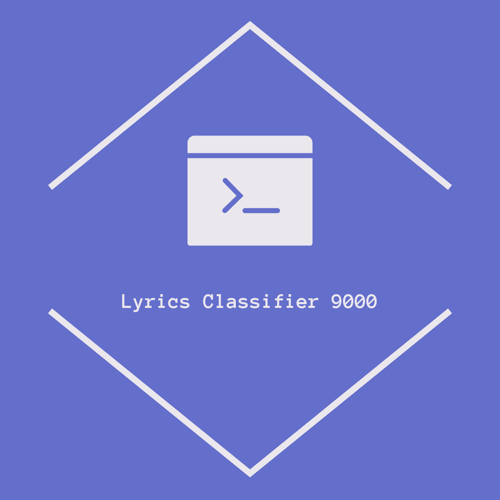

[![Contributors][contributors-shield]][contributors-url]
[![Forks][forks-shield]][forks-url]
[![Stargazers][stars-shield]][stars-url]
[![Issues][issues-shield]][issues-url]
[![MIT License][license-shield]][license-url]
[![LinkedIn][linkedin-shield]][linkedin-url]


<!-- PROJECT LOGO -->
<br />
<p align="center">
  <a href="https://github.com/dariustorabian/lyrics-classifier">
    
  </a>

  <h3 align="center">Lyrics Classifier 9000</h3>

  <p align="center">
    A lyrics scraper and classifer with a CLI.
    <br />
    <br />
    <a href="https://github.com/dariustorabian/lyrics-classifier/issues">Report Bug</a>
    ·
    <a href="https://github.com/dariustorabian/lyrics-classifier/issues">Request Feature</a>
  </p>
</p>


<!-- TABLE OF CONTENTS -->
## Table of Contents

* [About the Project](#about-the-project)
  * [Built With](#built-with)
* [Getting Started](#getting-started)
  * [Prerequisites](#prerequisites)
  * [Installation](#installation)
* [Roadmap](#roadmap)
* [Contributing](#contributing)
* [License](#license)
* [Contact](#contact)
* [Acknowledgements](#acknowledgements)


<!-- ABOUT THE PROJECT -->
## About The Project


In this project, I've built a lyrics scraper that automatically scrapes all songtexts of a given artist from his lyrics.com artistpage. The data is then written in a .json file. The .json's can then be used to create a 
Multinominal Naive Bayes model using spaCy's industry-strength natural language processor. The user can then input a string of text of his choice and the model will predict, which artist would have most likely sung that line, even if the artist never did.

All modules have their own command-line interface for easy use. All credit for the songtexts belong to lyrics.com for their amazing work. Please follow common sense while scraping and don't DDOS them.


### Built With

* [scikit-learn](https://scikit-learn.org/)
* [Beautiful Soup 4](https://www.crummy.com/software/BeautifulSoup/bs4/doc/)
* [spaCy](https://spacy.io/)


<!-- GETTING STARTED -->
## Getting Started

To get a local copy up and running follow these simple steps.

### Prerequisites

I'd advice you to create an own virtual environment for this project. I'm using [Anaconda](https://anaconda.org/).


### Installation & Usage

1. Clone the repo
```sh
git clone https://github.com/dariustorabian/lyrics-classifier.git
```
2. Install dependencies with the requirements.txt
```sh
conda create --name <NameOfEnvironment> --file requirements.txt
```

3. Run [lyrics_scraper.py](https://github.com/dariustorabian/lyrics-classifier/blob/master/src/lyrics_scraper.py) in the command line and with an artistpage URL from lyrics.com and an filename as arguments. For help, run `python lyrics_scraper.py -h`. The lyrics of this artist will then be scraped and saved under `/data/FILENAME.json`. Duplicates will be skipped automatically. Repeat this step for as many artists as you'd like to use.


4. Run [model_creater.py](https://github.com/dariustorabian/lyrics-classifier/blob/master/src/model_creater.py) in the command line. You will be asked to input the `.json` files containing the songtexts that were scraped in the previous step and corresponding artist names. Then the Multinominal Naive Bayes model will be created and saved locally.


5. Run [lyrics_classifier.py](https://github.com/dariustorabian/lyrics-classifier/blob/master/src/lyrics_model.py) in the command line. It will automatically load the model created in the previous step. You will be askedd to input a string of text and get predictions on which artist of the ones in your model most likely sung that line. Feel free to use my `model.p` which is trained on `The Kooks, Mumford & Sons and Eminem`.


<!-- ROADMAP -->
## Roadmap

Currently, there are no new features in planning. This could change though, so feel free to check back again.

You can also always take a look at the [open issues](https://github.com/dariustorabian/lyrics-classifier/issues) for a list of proposed features (and known issues).


<!-- CONTRIBUTING -->
## Contributing

Contributions are what make the open source community such an amazing place to be learn, inspire, and create. Any contributions you make are **greatly appreciated**.

1. Fork the Project
2. Create your Feature Branch (`git checkout -b feature/AmazingFeature`)
3. Commit your Changes (`git commit -m 'Add some AmazingFeature'`)
4. Push to the Branch (`git push origin feature/AmazingFeature`)
5. Open a Pull Request


<!-- LICENSE -->
## License

Distributed under the MIT License. See `LICENSE` for more information.


<!-- CONTACT -->
## Contact

Darius Torabian

* Feel free to contact me via [mail](mailto:darius.torabian@gmail.com).
* Here's my [linkedin profile](https://www.linkedin.com/in/dariustorabian).
* My twitter-handle is:[@darius_torabian](https://twitter.com/darius_torabian).
* This is my [website](https://dariustorabian.de).

Project Link: [https://github.com/dariustorabian/lyrics-classifier](https://github.com/dariustorabian/lyrics-classifier)


<!-- ACKNOWLEDGEMENTS -->
## Acknowledgements

* [lyrics.com](lyrics.com)


<!-- MARKDOWN LINKS & IMAGES -->
<!-- https://www.markdownguide.org/basic-syntax/#reference-style-links -->
[contributors-shield]: https://img.shields.io/github/contributors/dariustorabian/lyrics-classifier.svg?style=flat-square
[contributors-url]: https://github.com/dariustorabian/lyrics-classifier/graphs/contributors
[forks-shield]: https://img.shields.io/github/forks/dariustorabian/lyrics-classifier.svg?style=flat-square
[forks-url]: https://github.com/dariustorabian/lyrics-classifier/network/members
[stars-shield]: https://img.shields.io/github/stars/dariustorabian/lyrics-classifier.svg?style=flat-square
[stars-url]: https://github.com/dariustorabian/lyrics-classifier/stargazers
[issues-shield]: https://img.shields.io/github/issues/dariustorabian/lyrics-classifier.svg?style=flat-square
[issues-url]: https://github.com/dariustorabian/lyrics-classifier/issue
[license-shield]: https://img.shields.io/github/license/dariustorabian/lyrics-classifier.svg?style=flat-square
[license-url]: https://github.com/dariustorabian/lyrics-classifier/LICENSE.txt
[linkedin-shield]: https://img.shields.io/badge/-LinkedIn-black.svg?style=flat-square&logo=linkedin&colorB=555
[linkedin-url]: https://www.linkedin.com/in/dariustorabian
[product-screenshot]: images/screenshot.png